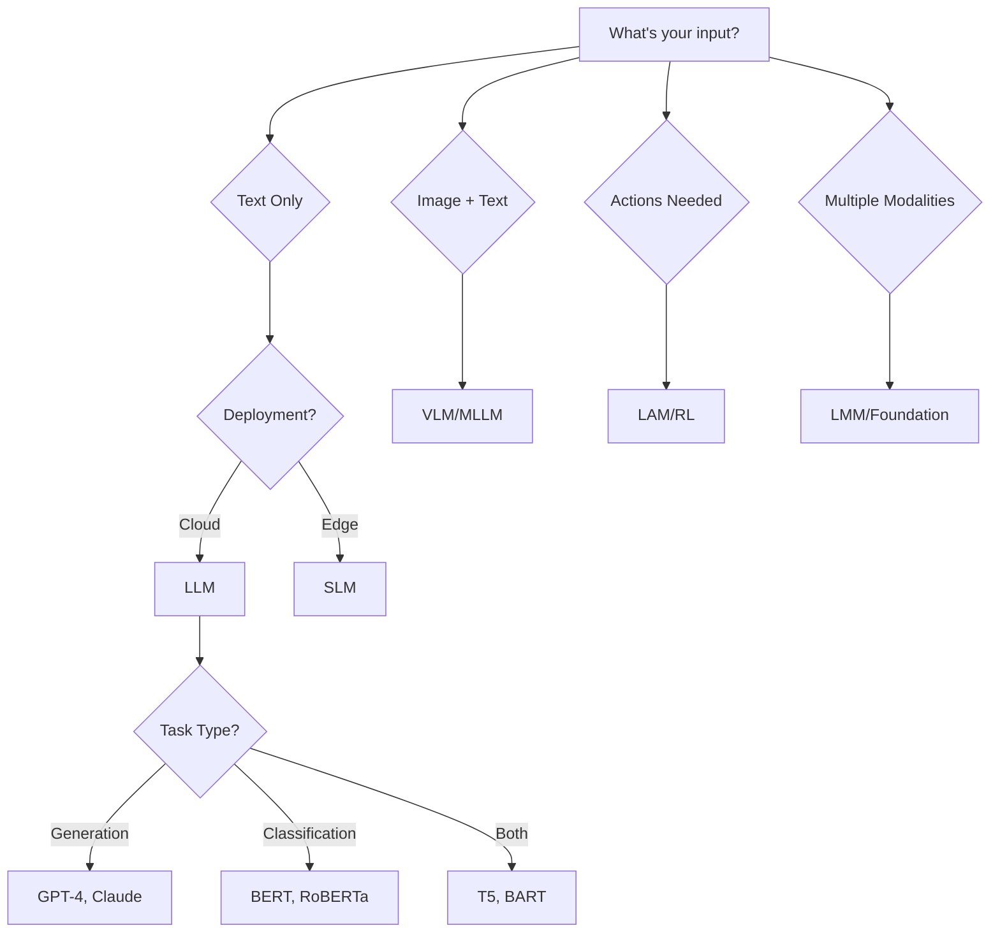

<div align="center">

# 🤖 AI Tips: Complete Guide to AI Architectures & Communication

### *Your Comprehensive Resource for Understanding Modern AI Systems*

[](https://opensource.org/licenses/MIT)
[](https://www.python.org/downloads/)
[](CONTRIBUTING.md)
[](./docs/)

**26 AI Model Architectures** • **5 Communication Protocols** • **100+ Examples** • **Production-Ready Patterns**

[📚 Documentation](#-documentation) • [🎯 Quick Start](#-quick-start) • [💡 Examples](#-examples) • [🤝 Contributing](#-contributing)

</div>

---

## 📖 Overview

This repository provides a **complete, professional guide** to modern AI model architectures and their communication patterns. Whether you're building production AI systems, conducting research, or learning about AI, you'll find:

- ✅ **26 AI model types** with detailed technical specifications
- ✅ **5 communication protocols** for AI agent interaction
- ✅ **100+ practical examples** with working code
- ✅ **Production patterns** and best practices
- ✅ **Jupyter notebooks** for interactive learning
- ✅ **Architecture diagrams** and decision frameworks

---

## 📚 Table of Contents

- [AI Model Architectures](#-ai-model-architectures)
- [Communication Protocols](#-communication-protocols)
- [Documentation](#-documentation)
- [Examples](#-examples)
- [Quick Start](#-quick-start)
- [Installation](#-installation)
- [Usage Patterns](#-usage-patterns)
- [Architecture Decision Guide](#-architecture-decision-guide)
- [Contributing](#-contributing)
- [License](#-license)

---

## 🤖 AI Model Architectures

### Language Models
- **[LLM - Large Language Model](./docs/models/LLM.md)** - Text generation and reasoning (GPT-4, Claude, Llama)
- **[SLM - Small Language Model](./docs/models/SLM.md)** - Efficient edge deployment (Phi-3, Gemma, TinyLlama)
- **[MLM - Masked Language Model](./docs/models/MLM.md)** - Bidirectional understanding (BERT, RoBERTa)
- **[Encoder-Decoder Models](./docs/models/ENCODER_DECODER.md)** - Seq2seq tasks (T5, BART, mT5)

### Vision Models
- **[VLM - Vision Language Model](./docs/models/VLM.md)** - Image + text understanding (GPT-4V, Claude 3)
- **[LVM - Large Vision Model](./docs/models/LVM.md)** - Pure vision tasks (DINOv2, CLIP encoders)
- **[SAM - Segment Anything Model](./docs/models/SAM.md)** - Universal segmentation (Meta SAM)
- **[Vision Transformers](./docs/models/VIT.md)** - Image classification (ViT, Swin, DeiT)

### Multimodal Models
- **[LMM - Large Multimodal Model](./docs/models/LMM.md)** - Native multimodal (Gemini, GPT-4o)
- **[MLLM - Multimodal LLM](./docs/models/MLLM.md)** - Extended LLMs (LLaVA, Qwen-VL)
- **[Multimodal Foundation Models](./docs/models/MULTIMODAL_FOUNDATION.md)** - Unified architectures

### Generative Models
- **[Diffusion Models](./docs/models/DIFFUSION.md)** - High-quality generation (Stable Diffusion, DALL-E)
- **[LCM - Latent Consistency Model](./docs/models/LCM.md)** - Fast image generation (4-step inference)
- **[GAN - Generative Adversarial Networks](./docs/models/GAN.md)** - Adversarial training (StyleGAN, BigGAN)
- **[VAE - Variational Autoencoder](./docs/models/VAE.md)** - Probabilistic generation

### Specialized Models
- **[LAM - Large Action Model](./docs/models/LAM.md)** - Task automation (Adept ACT-1, Rabbit R1)
- **[MOE - Mixture of Experts](./docs/models/MOE.md)** - Efficient scaling (Mixtral, GPT-4)
- **[RL Models](./docs/models/RL.md)** - Decision making (PPO, SAC, AlphaZero)
- **[GNN - Graph Neural Networks](./docs/models/GNN.md)** - Graph reasoning (GraphSAGE, GAT)
- **[World Models](./docs/models/WORLD_MODELS.md)** - Environment simulation (Dreamer, MuZero)

### Advanced Paradigms
- **[RAG - Retrieval Augmented Generation](./docs/models/RAG.md)** - Grounded generation
- **[Foundation Models](./docs/models/FOUNDATION.md)** - Pre-trained base models
- **[Contrastive Learning](./docs/models/CONTRASTIVE.md)** - Self-supervised learning (CLIP, SimCLR)
- **[NAS - Neural Architecture Search](./docs/models/NAS.md)** - Automated design (EfficientNet)
- **[Neurosymbolic AI](./docs/models/NEUROSYMBOLIC.md)** - Hybrid reasoning
- **[Federated Learning](./docs/models/FEDERATED.md)** - Privacy-preserving training

📖 **[Complete Professional Overview](./docs/PROFESSIONAL_OVERVIEW.md)** | **[Model Comparison Table](./docs/MODEL_COMPARISON.md)**

---

## 🎯 Real-World Use Cases

**See autonomous AI agents in action!** Complete, production-ready examples showing how agents communicate and collaborate without human intervention:

### 🎧 [Customer Service System](./examples/use-cases/customer_service/)
Multi-agent support with autonomous problem resolution
- **Agents**: Routing, Billing, Technical, General Support, Synthesis
- **Highlights**: Complex issue resolution, context sharing, quality control
- **Example**: "Service not working + overcharged" → Both issues resolved autonomously

### 💼 [Manager Assistant](./examples/use-cases/manager_assistant/)
Intelligent executive assistant with specialized agents
- **Agents**: Coordinator, Scheduling, Email, Data Analysis, Research, Report
- **Highlights**: Task orchestration, parallel processing, comprehensive reports
- **Example**: "Morning briefing" → Calendar + Emails + KPIs compiled automatically

### 🔧 [IT Operations Automation](./examples/use-cases/it_operations/)
Autonomous incident detection and remediation
- **Agents**: Monitoring, Triage, Diagnostic, Database, Network, Remediation, Reporting
- **Highlights**: 24/7 monitoring, self-healing systems, complete audit trail
- **Example**: High CPU detected → Diagnosed → Service restarted → System restored

### � [Market Intelligence System](./examples/use-cases/market_intelligence/)
Real-time market and competitive intelligence
- **Agents**: Competitor Analysis, Market Trends, Customer Sentiment, Pricing Intelligence, Financial Analysis
- **Highlights**: Parallel data gathering, comprehensive insights, strategic recommendations
- **Example**: Market analysis → Competitor positioning + Trends + Sentiment + Pricing → Strategic recommendations

### 💼 [Business Intelligence Dashboard](./examples/use-cases/business_intelligence/)
Automated executive dashboards and analytics
- **Agents**: Data Aggregation, Sales Analytics, Marketing Analytics, Financial Analytics, Operational Analytics, Predictive Analytics
- **Highlights**: Multi-source integration, real-time insights, predictive forecasting
- **Example**: Dashboard generation → Sales + Marketing + Finance + Operations → Executive summary with priorities

**[🚀 View All Use Cases →](./examples/use-cases/)**

---

## 🔗 Communication Protocols

Understanding how AI models, agents, and systems communicate:

### Core Protocols
- **[MCP - Model Context Protocol](./docs/protocols/MCP.md)** - Standardized context sharing between AI and tools
  - JSON-RPC 2.0 based
  - Resource management (files, databases, APIs)
  - Prompt templates and tool calling
  - Production examples with Python and TypeScript

- **[A2A - Agent-to-Agent](./docs/protocols/A2A.md)** - Direct peer communication between AI agents
  - Multi-agent coordination patterns
  - Task decomposition and delegation
  - Consensus mechanisms
  - Collaborative problem-solving examples

- **[A2P - Agent-to-Person](./docs/protocols/A2P.md)** - Human-AI interaction patterns
  - Conversational interfaces
  - Clarification and feedback loops
  - User preference learning
  - Accessibility considerations

- **[A2S - Agent-to-System](./docs/protocols/A2S.md)** - AI integration with external systems
  - API integration patterns
  - Database operations
  - Event-driven architectures
  - System monitoring and logging

### Production Patterns
- **[Multi-Agent Orchestration](./docs/protocols/ORCHESTRATION.md)** - Coordinating multiple AI agents
  - Sequential, parallel, hierarchical patterns
  - Event-driven and pipeline orchestration
  - Task distribution and load balancing
  - State management and error handling
  - Production monitoring and health checks

- **[Workflow Patterns](./docs/protocols/WORKFLOWS.md)** - Designing agent workflows
  - Sequential, parallel, and conditional workflows
  - ETL pipelines for business intelligence
  - Real-time processing workflows
  - Decision workflows and templates
  - Error recovery strategies

- **[MLOps for Agents](./docs/protocols/MLOPS.md)** - Production deployment and operations
  - Blue-green and canary deployments
  - A/B testing for agent versions
  - Monitoring and observability
  - Performance optimization and scaling
  - Cost optimization strategies
  - Security and compliance


---

## 💡 Examples

### Basic Usage
Explore individual model examples in [`examples/basic/`](./examples/basic/):
- Text generation with LLMs
- Image analysis with VLMs
- Segmentation with SAM
- Fast generation with LCM
- Edge deployment with SLMs

### Multi-Model Workflows
Complex scenarios combining multiple models [`examples/workflows/`](./examples/workflows/):
- **Document Intelligence**: OCR (VLM) → Summary (LLM) → Classification (MLM)
- **Content Creation**: Text (LLM) → Image (Diffusion) → Edit (LCM)
- **Data Analysis**: Extract (VLM) → Analyze (LLM) → Visualize (Code execution)
- **Automation**: Plan (LLM) → Execute (LAM) → Verify (VLM)

### Communication Patterns
Inter-model communication examples [`examples/communication/`](./examples/communication/):
- MCP server implementation (Python & TypeScript)
- Multi-agent collaboration systems
- Human-in-the-loop workflows
- System integration patterns

### Production Use Cases
Complete implementations [`examples/use-cases/`](./examples/use-cases/):
- **Customer Support Bot**: RAG + LLM + sentiment analysis
- **Medical Imaging Pipeline**: SAM + classification + reporting
- **Research Assistant**: Multi-agent system with specialized models
- **Content Moderation**: VLM + classification + decision logic
- **Code Assistant**: RAG + code-specialized LLM + execution

### Interactive Notebooks
Jupyter notebooks for hands-on learning [`notebooks/`](./notebooks/):
- [00_Index.ipynb](./notebooks/00_Index.ipynb) - Navigation guide
- [01_LLM_Examples.ipynb](./notebooks/01_LLM_Examples.ipynb) - Language model examples
- [02_VLM_Examples.ipynb](./notebooks/02_VLM_Examples.ipynb) - Vision-language examples
- [03_SLM_Examples.ipynb](./notebooks/03_SLM_Examples.ipynb) - Edge deployment
- [04_Advanced_Models.ipynb](./notebooks/04_Advanced_Models_MOE_SAM_LCM_MLM.ipynb) - Specialized models
- [05_Multimodal_Communication.ipynb](./notebooks/05_Multimodal_And_Communication.ipynb) - Protocols

---

## 🎯 Quick Start

### Prerequisites
```bash
# Python 3.8 or higher
python --version

# Install dependencies
pip install -r requirements.txt
```

### Run Your First Example
```python
# examples/basic/llm_simple.py
import openai

client = openai.OpenAI()

response = client.chat.completions.create(
    model="gpt-4",
    messages=[{"role": "user", "content": "Explain quantum computing"}]
)

print(response.choices[0].message.content)
```

### Try Multi-Model Communication
```python
# examples/communication/mcp_simple.py
from mcp_client import MCPClient

# Connect to MCP server
client = MCPClient("http://localhost:8000")

# LLM requests data via MCP
context = client.get_resource("file://documents/report.pdf")

# LLM processes with grounded context
response = llm.generate(context + "\n\nSummarize this report")
```

### Explore Notebooks
```bash
# Start Jupyter
jupyter notebook notebooks/00_Index.ipynb
```

---

## 📦 Installation

### Option 1: Complete Installation
```bash
# Clone repository
git clone https://github.com/abedhraiz/ai_tips.git
cd ai_tips

# Create virtual environment
python -m venv venv
source venv/bin/activate  # On Windows: venv\Scripts\activate

# Install all dependencies
pip install -r requirements.txt

# Verify installation
python scripts/verify_setup.py
```

### Option 2: Minimal Installation (Documentation Only)
```bash
# Clone and browse documentation
git clone https://github.com/abedhraiz/ai_tips.git
cd ai_tips

# Open in browser or markdown viewer
# No dependencies needed for documentation
```

### Option 3: Docker
```bash
# Build image
docker build -t ai-tips .

# Run container with Jupyter
docker run -p 8888:8888 ai-tips

# Access at http://localhost:8888
```

### API Keys Setup
```bash
# Create .env file
cp .env.example .env

# Add your API keys
echo "OPENAI_API_KEY=your_key_here" >> .env
echo "ANTHROPIC_API_KEY=your_key_here" >> .env
```

---

## 🏗️ Usage Patterns

### Pattern 1: Single Model
```python
# Use one model for focused task
from transformers import pipeline

classifier = pipeline("sentiment-analysis")
result = classifier("This product is amazing!")
```

### Pattern 2: Sequential Pipeline
```python
# Chain models for complex workflows
image_caption = vlm.describe(image)           # VLM
expanded_text = llm.expand(image_caption)     # LLM
visualization = diffusion.generate(expanded_text)  # Diffusion
```

### Pattern 3: Parallel Processing
```python
# Run models concurrently
import asyncio

async def process_document(doc):
    summary_task = llm.summarize(doc)
    entities_task = mlm.extract_entities(doc)
    sentiment_task = mlm.analyze_sentiment(doc)
    
    return await asyncio.gather(summary_task, entities_task, sentiment_task)
```

### Pattern 4: RAG (Retrieval-Augmented)
```python
# Ground LLM with external knowledge
from langchain import RAG

rag = RAG(
    retriever=vector_db,
    generator=llm,
    top_k=5
)

answer = rag.query("What is quantum entanglement?")
```

### Pattern 5: Multi-Agent System
```python
# Coordinate multiple specialized agents
from agents import AgentOrchestrator

orchestrator = AgentOrchestrator([
    ResearchAgent(llm="gpt-4"),
    WriterAgent(llm="claude-3"),
    EditorAgent(llm="llama-3")
])

result = orchestrator.execute("Write a research paper on AI ethics")
```

---

## 🧭 Architecture Decision Guide

### Choose Your Model



### Decision Matrix

| Your Requirement | Recommended Architecture | Example Models |
|-----------------|-------------------------|----------------|
| **Text generation, high quality** | Large LLM | GPT-4, Claude 3, Gemini |
| **Text generation, fast/efficient** | Small LLM | Phi-3, Gemma, TinyLlama |
| **Image understanding** | VLM | GPT-4V, Claude 3 Vision |
| **Image generation** | Diffusion/LCM | Stable Diffusion, DALL-E |
| **Image segmentation** | SAM | Segment Anything |
| **Web automation** | LAM | Adept ACT-1 |
| **Classification/NER** | MLM | BERT, RoBERTa, DeBERTa |
| **Multi-domain tasks** | MOE | Mixtral, GPT-4 (rumored) |
| **Graph/network data** | GNN | GraphSAGE, GAT |
| **Grounded answers** | RAG | LangChain, LlamaIndex |
| **Privacy-critical** | Federated/On-device | Local SLM, Federated training |
| **Multi-modal native** | Foundation Models | Gemini, GPT-4o, ImageBind |

---

## 📊 Performance Comparison

### Inference Speed (Tokens/Second)

| Model Type | Size | Speed | Latency | Use Case |
|-----------|------|-------|---------|----------|
| SLM | 1-7B | 100-200 | <100ms | Edge, mobile |
| LLM | 7-70B | 20-50 | 200-500ms | Cloud, quality |
| MOE | 8x7B | 40-80 | 150-300ms | Efficiency |
| LCM | 1-5B | 0.5s/image | <1s | Fast generation |
| Diffusion | 1-5B | 5s/image | 5-10s | Quality generation |

### Memory Requirements

| Model | Parameters | RAM (FP16) | RAM (INT8) | RAM (INT4) |
|-------|-----------|-----------|-----------|-----------|
| TinyLlama | 1.1B | 2.2 GB | 1.1 GB | 0.6 GB |
| Llama 3 8B | 8B | 16 GB | 8 GB | 4 GB |
| Llama 3 70B | 70B | 140 GB | 70 GB | 35 GB |
| Mixtral 8x7B | 46.7B | 94 GB | 47 GB | 24 GB |

---

## 📚 Documentation

### Model Documentation
- [Complete Professional Overview](./docs/PROFESSIONAL_OVERVIEW.md) - Comprehensive technical reference
- [Model Comparison Matrix](./docs/MODEL_COMPARISON.md) - Side-by-side comparison
- [Individual Model Docs](./docs/models/) - Detailed per-model documentation

### Protocol Documentation
- [Communication Protocols](./docs/protocols/) - MCP, A2A, A2P, A2S, Orchestration
- [Integration Patterns](./docs/PATTERNS.md) - Common architectural patterns
- [Best Practices](./docs/BEST_PRACTICES.md) - Production recommendations

### Learning Resources
- [Glossary](./docs/GLOSSARY.md) - AI terminology and definitions
- [FAQ](./docs/FAQ.md) - Frequently asked questions
- [Tutorials](./docs/TUTORIALS.md) - Step-by-step guides
- [Architecture Diagrams](./docs/diagrams/) - Visual references

---

## 🛠️ Project Structure

```
ai_tips/
├── README.md                          # This file
├── requirements.txt                   # Python dependencies
├── .env.example                       # Environment template
├── LICENSE                            # MIT License
│
├── docs/                              # Documentation
│   ├── PROFESSIONAL_OVERVIEW.md       # Complete technical guide
│   ├── MODEL_COMPARISON.md            # Model comparison matrix
│   ├── BEST_PRACTICES.md              # Production guidelines
│   ├── PATTERNS.md                    # Architecture patterns
│   ├── GLOSSARY.md                    # Terminology
│   ├── FAQ.md                         # Common questions
│   ├── TUTORIALS.md                   # Learning guides
│   │
│   ├── models/                        # Model-specific docs (26 files)
│   │   ├── LLM.md, VLM.md, SLM.md   # Language models
│   │   ├── GAN.md, VAE.md, DIFFUSION.md # Generative models
│   │   ├── SAM.md, GNN.md, RL.md    # Specialized models
│   │   └── ... (23 more)
│   │
│   ├── protocols/                     # Communication protocols
│   │   ├── MCP.md                    # Model Context Protocol
│   │   ├── A2A.md                    # Agent-to-Agent
│   │   ├── A2P.md                    # Agent-to-Person
│   │   ├── A2S.md                    # Agent-to-System
│   │   └── ORCHESTRATION.md          # Multi-agent coordination
│   │
│   └── diagrams/                      # Architecture diagrams
│       ├── model_comparison.svg
│       ├── communication_flow.svg
│       └── deployment_patterns.svg
│
├── examples/                          # Practical code examples
│   ├── basic/                        # Single model examples
│   │   ├── llm_simple.py
│   │   ├── vlm_image_analysis.py
│   │   ├── sam_segmentation.py
│   │   └── ... (20+ examples)
│   │
│   ├── workflows/                    # Multi-model pipelines
│   │   ├── document_intelligence.py
│   │   ├── content_creation.py
│   │   ├── data_analysis_pipeline.py
│   │   └── automation_workflow.py
│   │
│   ├── communication/                # Inter-model communication
│   │   ├── mcp_server.py
│   │   ├── mcp_client.py
│   │   ├── multi_agent_system.py
│   │   └── orchestration_example.py
│   │
│   └── use-cases/                    # Complete implementations
│       ├── customer_support/
│       ├── medical_imaging/
│       ├── research_assistant/
│       ├── content_moderation/
│       └── code_assistant/
│
├── notebooks/                         # Jupyter notebooks
│   ├── 00_Index.ipynb
│   ├── 01_LLM_Examples.ipynb
│   ├── 02_VLM_Examples.ipynb
│   ├── 03_SLM_Examples.ipynb
│   ├── 04_Advanced_Models_MOE_SAM_LCM_MLM.ipynb
│   └── 05_Multimodal_And_Communication.ipynb
│
├── scripts/                           # Utility scripts
│   ├── verify_setup.py               # Installation verification
│   ├── benchmark.py                  # Performance testing
│   └── deploy.py                     # Deployment helper
│
└── tests/                             # Unit tests
    ├── test_examples.py
    ├── test_protocols.py
    └── test_utils.py
```

---

## 🤝 Contributing

We welcome contributions! Here's how you can help:

### Ways to Contribute
- 📝 **Documentation**: Improve explanations, add examples, fix typos
- 💻 **Code**: Add new examples, improve existing code, fix bugs
- 🎨 **Diagrams**: Create visual aids and architecture diagrams
- 🐛 **Issues**: Report bugs, suggest features, ask questions
- 📚 **Tutorials**: Write guides and tutorials
- 🌐 **Translation**: Translate documentation to other languages

### Contribution Process
1. **Fork** the repository
2. **Create** a feature branch (`git checkout -b feature/AmazingFeature`)
3. **Commit** your changes (`git commit -m 'Add AmazingFeature'`)
4. **Push** to the branch (`git push origin feature/AmazingFeature`)
5. **Open** a Pull Request

See [CONTRIBUTING.md](./CONTRIBUTING.md) for detailed guidelines.

---

## 📄 License

This project is licensed under the **MIT License** - see the [LICENSE](./LICENSE) file for details.

```
MIT License - Copyright (c) 2025 AI Tips Contributors

Permission is hereby granted, free of charge, to any person obtaining a copy
of this software and associated documentation files (the "Software"), to deal
in the Software without restriction, including without limitation the rights
to use, copy, modify, merge, publish, distribute, sublicense, and/or sell
copies of the Software, and to permit persons to whom the Software is
furnished to do so, subject to the following conditions:

The above copyright notice and this permission notice shall be included in all
copies or substantial portions of the Software.
```

---

## 🌟 Acknowledgments

- **OpenAI** - GPT models and CLIP
- **Anthropic** - Claude models
- **Meta** - Llama, SAM, and open-source contributions
- **Google** - Gemini, T5, BERT, and research
- **Microsoft** - Phi models and Azure AI
- **Hugging Face** - Transformers library and model hub
- **Community Contributors** - Everyone who has contributed to this project

---

## 📞 Contact & Support

- **Issues**: [GitHub Issues](https://github.com/abedhraiz/ai_tips/issues)
- **Discussions**: [GitHub Discussions](https://github.com/abedhraiz/ai_tips/discussions)
- **Email**: abedhraiz@example.com
- **Twitter**: [@abedhraiz](https://twitter.com/abedhraiz)

---

## 🗺️ Roadmap

### Completed ✅
- [x] 26 AI model type documentation
- [x] 5 communication protocol guides
- [x] 100+ code examples
- [x] Interactive Jupyter notebooks
- [x] Professional overview documentation

### In Progress 🚧
- [ ] Video tutorials for each model type
- [ ] Interactive web-based model selector
- [ ] Deployment templates (Docker, Kubernetes)
- [ ] Performance benchmarking suite

### Planned 📋
- [ ] Multi-language support (Spanish, Chinese, Arabic)
- [ ] Real-world case study deep-dives
- [ ] Cloud provider integration guides (AWS, Azure, GCP)
- [ ] MLOps and monitoring best practices
- [ ] Community model contributions
- [ ] API reference documentation

---

## 📈 Stats


---

<div align="center">

**[⬆ Back to Top](#-ai-tips-complete-guide-to-ai-architectures--communication)**

Made with ❤️ by the AI community

**Star ⭐ this repository if you find it helpful!**

</div>

This is a living document. Contributions, corrections, and suggestions are welcome!

---

## 📝 License

MIT License - Feel free to use these resources for learning and development.

---

**Last Updated**: November 8, 2025
